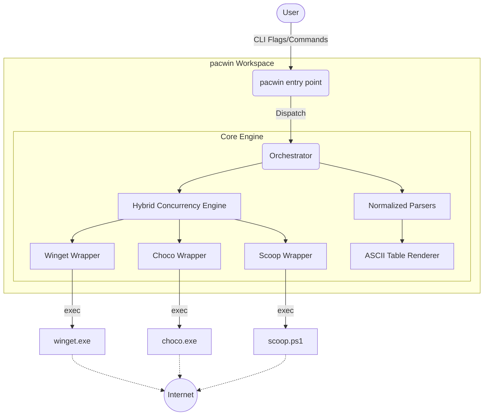
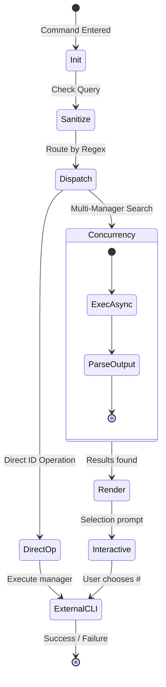

<table border="0">
  <tr>
    <td width="200" align="center" valign="top">
      
    </td>
    <td valign="top">
      <h1>pacwin</h1>
      <p><strong>One CLI. Three managers. Zero excuses.</strong><br/>
      <em>Unified, pacman-inspired package management layer for Windows (winget, chocolatey, scoop).</em></p>
      <p>
        <a href="https://www.powershellgallery.com/packages/pacwin"></a>
        <a href="LICENSE"></a>
        
        
      </p>
    </td>
  </tr>
</table>

---

<p align="center">
  
</p>

---

<!--toc:start-->
- [pacwin](#pacwin)
  - [Overview](#overview)
  - [Using as a CLI Tool](#using-as-a-cli-tool)
  - [Installation](#installation)
  - [Key Features (v0.4.0)](#key-features)
  - [Technical Architecture](#technical-architecture)
  - [Core Lifecycle](#core-lifecycle)
  - [Command Reference](#command-reference)
  - [Roadmap & Milestones](#roadmap--milestones)
  - [Acknowledgments](#acknowledgments)
  - [Contributing](#contributing)
  - [License](#license)
<!--toc:end-->

## Overview

**pacwin** unifies **winget**, **chocolatey**, and **scoop** behind a single, `pacman`-inspired interface for Windows. If you've ever typed `pacman -Syu` out of pure muscle memory on a PowerShell prompt—and felt the void when it didn't work—this tool was written for you.

For command-line users, this project provides a powerful CLI interface to interact with multiple package managers concurrently.

At its heart lies **`pacwin.psm1`**, a high-performance orchestration layer. Built upon **PowerShell 5.1** and **PowerShell 7+**, it exposes a consistent syntax across otherwise fragmented tools.

For end-users, pacwin ships with a **unified search engine**, cross-manager updates, and intelligent error interpretation.

---

## Using as a CLI Tool

The CLI provides a straightforward interface to interact with your package managers using either verbose or `pacman`-style shorthand.

Unlike standard wrappers, **pacwin is designed for speed**. If you are building a dev environment or orchestrating systems, you can drop `pacwin` directly into your workflow.

```powershell
pacwin -Ss vim        # Search across all managers
pacwin -S neovim      # Install from the best available source
pacwin -Syu           # Update everything
```

**Why use `pacwin`?**
* **Zero Cognitive Load:** Use the syntax you already know from Linux.
* **Hybrid Concurrency:** Uses threads (Runspaces) instead of heavy processes for 3x faster searches.
* **Decoded Status:** Real-time decoding of cryptic Windows exit codes.
* **Smart Filtering:** Easily force specific managers with the `-Manager` flag.

---

## Installation

### Via PowerShell Gallery (Recommended)

```powershell
Install-Module -Name pacwin -Scope CurrentUser
```

### Via curl (One-Liner)

```powershell
curl -sSL https://raw.githubusercontent.com/julesklord/pacwin/main/get-pacwin.ps1 | powershell -Command -
```

### From Source

```powershell
git clone https://github.com/julesklord/pacwin.git
cd pacwin
.\install.ps1
```

---

## Key Features (v0.4.0)

*   **Multi-Manager Search**: Concurrent scanning of Winget, Chocolatey, and Scoop.
*   **Intelligent Selection**: Yaourt-style interactive prompts for numbered package selection.
*   **Robust Parsers**: Locale-aware column detection and noise filtering for consistent output.
*   **Security Hardened**: Strict input sanitization and path validation to prevent shell injection.
*   **Unified Concurrency**: Automatic detection of PS version to use the fastest async model available.
*   **Diagnostic Doctor**: Health check tool to verify manager status and PATH configuration.
*   **State Management**: Export/Import package lists to JSON for backup or migration.

---

## Technical Architecture

pacwin operates as a high-level abstraction layer that standardizes input and normalizes output from external CLIs.



### Core Components

- **`pacwin.psm1`**: The main script module containing the dispatch logic and search engine.
- **`_pw_search_all`**: The concurrency fan-out core using RunspacePool or Parallel pipelines.
- **`_pw_parse_*`**: Dedicated parsers for each manager's unique output format.

---

## Core Lifecycle

The application follows this workflow from user interaction to package operation.



### Key Engineering Decisions

- **Single file:** No compilation or dependencies for maximum portability.
- **Same-process concurrency:** Thread-based async execution to avoid process overhead.
- **Normalized model:** All parsers emit a standard PSCustomObject for reliable piping.

---

## Command Reference

For a comprehensive breakdown, see the **[Wiki](https://github.com/julesklord/pacwin/wiki)**.  

*   **[Installation Guide](docs/wiki/Installation.md)**
*   **[CLI Command Reference](docs/wiki/CLI-Guide.md)**
*   **[Technical Architecture](docs/wiki/Architecture.md)**

| Full Command | Short Alias | Description |
| :--- | :--- | :--- |
| `pacwin search` | `-Ss` | Search across all managers. |
| `pacwin install` | `-S` | Install a package from source. |
| `pacwin update` | `-Syu` | Update all installed packages. |
| `pacwin list` | `-Q` | View all installed packages. |
| `pacwin doctor` | `check` | Verify system health. |

---

## Roadmap & Milestones

| Version | Status | Milestone |
| --- | --- | --- |
| **v0.1.0** | ✅ | First hybrid search engine release. |
| **v0.2.0** | ✅ | Export/Import and Tab Completion. |
| **v0.3.0** | ✅ | Major performance refactor & test coverage. |
| **v0.4.0** | ✅ | Fixed Scoop detection (sfsu hook support). |
| **v0.4.0** | ⏳ | UI Rebrand & Enhanced Telemetry. |

---

## Acknowledgments

- **[Arch Linux Pacman](https://archlinux.org/pacman/)** — For the superior syntax that inspired this project.
- **[Scoop](https://scoop.sh/)** — For making Windows package management actually usable.

## Contributing

Pull requests are welcome. For major changes, open an RFC issue first. See `CONTRIBUTING.md` for guidelines.

## License

<p align="center">
  Engineered by <a href="https://github.com/julesklord">julesklord</a>.<br>
  Released under the terms of the MIT License.
</p>
